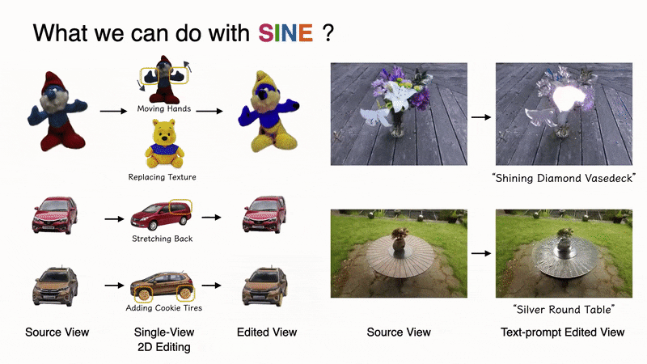

# SINE: Semantic-driven Image-based NeRF Editing with Prior-guided Editing Field

### [Project Page](https://zju3dv.github.io/sine/) | [Video](https://www.youtube.com/watch?v=bCovxTtO7vs) | [Paper](https://github.com/chobao/open_access_assets/raw/main/sine/paper.pdf)
<div align=center>

</div>

> [SINE: Semantic-driven Image-based NeRF Editing with Prior-guided Editing Field](https://github.com/chobao/open_access_assets/raw/main/sine/paper.pdf)  
> 
> [[Chong Bao](https://chobao.github.io/), [Yinda Zhang](https://www.zhangyinda.com/)<sup>Co-Authors</sup>,[Bangbang Yang](https://ybbbbt.com)<sup>Co-Authors</sup>], [Tianxing Fan](https://scholar.google.com/citations?user=siv1RXUAAAAJ&hl=zh-CN), [Zesong Yang](https://github.com/YZsZY), [Hujun Bao](http://www.cad.zju.edu.cn/home/bao/),   [Guofeng Zhang](http://www.cad.zju.edu.cn/home/gfzhang/), [Zhaopeng Cui](https://zhpcui.github.io/). 
> 
> CVPR 2023
> 
## Brewing🍺, code coming soon.

## Citing
```
@inproceedings{bao2023sine,
    title={SINE: Semantic-driven Image-based NeRF Editing with Prior-guided Editing Field},
    author={Bao, Chong and Zhang, Yinda and Yang, Bangbang and Fan, Tianxing and Yang, Zesong and Bao, Hujun and Zhang, Guofeng and Cui, Zhaopeng},
    booktitle={The IEEE/CVF Computer Vision and Pattern Recognition Conference (CVPR)},
    year={2023}
}
```


